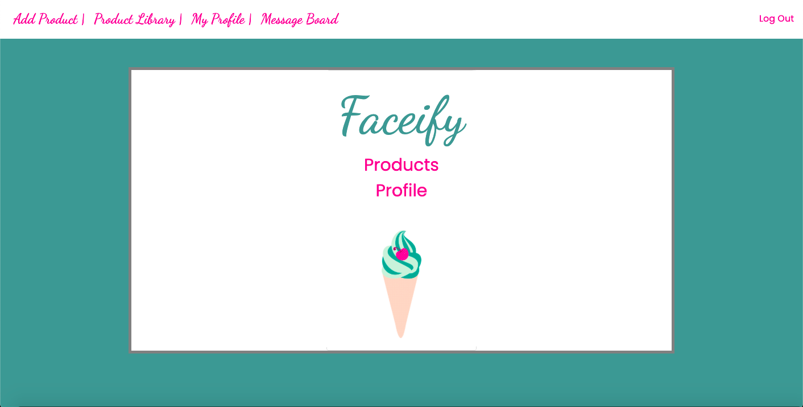

# Faceify
A publicly sourced skin-care database and social platform!

# Technologies Used:
- Node.js
- Express
- MongoDB Atlas
- Mongoose
- EJS Templating
- Google OAuth
- Github
- Heroku
- Visual Code Studio

# Getting Started:
For my unit 2 project at GA I wanted to see what it would look like to mesh my knowledge of Esthetics and new found interest in Software Engineering. This resulted in developing a community oriented approach to skin-care. Users can create and edit their personal profiles, share and perform full CRUD capabilities on products they use and love, and interact with the community via a message board to talk routines, experiences, get ideas, and anything else skin-care related. 

Check it out [here](https://faceify-project.herokuapp.com/)

# Take a peek at a piece of the planning process:
My Trello board can be viewed [here](https://trello.com/b/xRRvQe8B/unit-2-project)

# Next-Steps:
- Implement a search function in the database so users can search products by skin type (oily, dry, sensitive..etc), concern, or other
- Add the ability for a user to attach a link to the product they are posting and be able to verify it is a relevant, safe, and active link
- Add functionality to @ the op in the message reply thread when other users reply to their messages
- Prevent the same product from being entered twice
- Implement a rating system to bring top rated products to the front of the search

